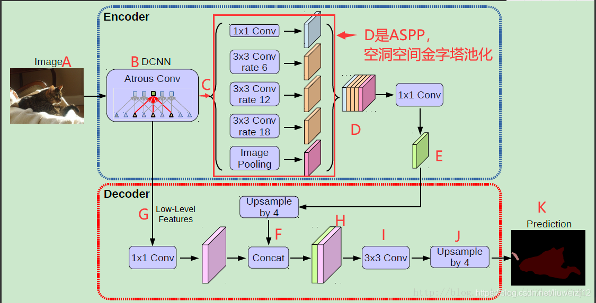

（1）一张图片A，送进改造过后的主流深度卷积网络B（DCNN,加入了一个空洞卷积Atrous Conv）提取特征，得到高级语义特征C和低级语义特征G。
（2）高级语义特征C进入到空洞金字塔池化模块ASPP，分别与四个空洞卷积层和一个池化层进行卷积和池化，得到五个特征图，然后连接成五层D。D再通地一个1*1的卷积进行运算后得到E; E再经过上采样得到F。
（3）通过在深度卷积网络层找到一个与F分辨率相同的低级语义特征图G；经过1*1卷积进行降通道数使之与F所占通道比重一样，更有利于模型学习
（4）合并成H，然后再通过一个3*3细化卷积进行细化；后通过双线性上采样4倍，得到预测结果。

参考文献：

[DeepLabV3+ 基本原理及Pytorch版注解](https://blog.csdn.net/liuweizj12/article/details/106444275?spm=1001.2101.3001.6650.6&utm_medium=distribute.pc_relevant.none-task-blog-2%7Edefault%7ECTRLIST%7ERate-6-106444275-blog-108133672.pc_relevant_recovery_v2&depth_1-utm_source=distribute.pc_relevant.none-task-blog-2%7Edefault%7ECTRLIST%7ERate-6-106444275-blog-108133672.pc_relevant_recovery_v2&utm_relevant_index=8)

[DeepLabv3+：Encoder-Decoder with Atrous Separable Convolution语义分割模型在Pytorch当中的实现](https://github.com/bubbliiiing/deeplabv3-plus-pytorch)