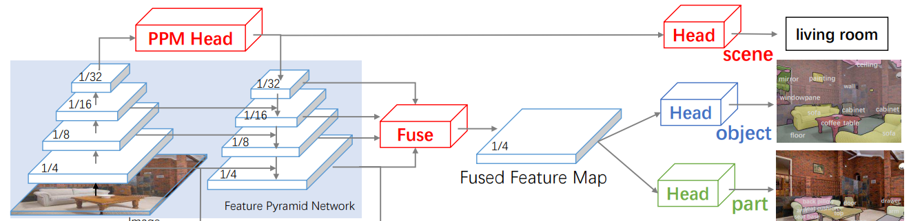

使用Swin_transformer作为backbone，同时使用UPerNet作为decoder的结构

参考链接：

[语义分割系列15-UPerNet](https://blog.csdn.net/yumaomi/article/details/125376320?ops_request_misc=%257B%2522request%255Fid%2522%253A%2522167809504116800227485514%2522%252C%2522scm%2522%253A%252220140713.130102334..%2522%257D&request_id=167809504116800227485514&biz_id=0&utm_medium=distribute.pc_search_result.none-task-blog-2~all~top_positive~default-1-125376320-null-null.142^v73^insert_down1,201^v4^add_ask,239^v2^insert_chatgpt&utm_term=upernet&spm=1018.2226.3001.4187)